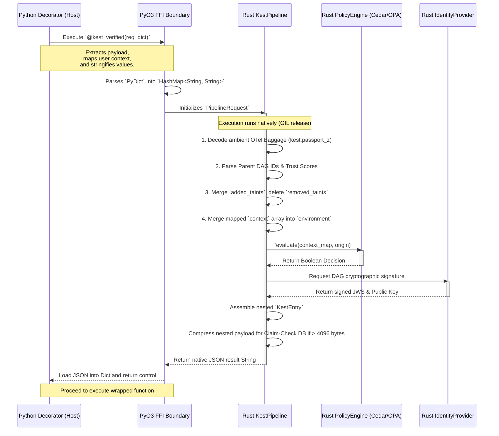

# `kest-runtime-rs` (V2 Pipeline)
**The High-Throughput, Polyglot Native Runner for the Kest Verification Toolkit**

---

This README is an authoritative reference designed for both **Human Engineers** and **AI Agents** developing, extending, or debugging the Kest toolkit. It comprehensively details the architecture, data pathways, and internal implementation quirks of the `v2` pipeline execution layer.

> [!IMPORTANT]
> The principles of this crate exist to fulfill the normative requirements set out in `SPEC-v0.3.0.md` without suffering from the overhead of high-level interpreter locks.

---

## 🏗 Why `kest-runtime-rs` Exists

During load-testing of the standard Python implementation (V1), Kest experienced a "GIL Contention Cliff". Heavy I/O bound to the interpreter—specifically OpenTelemetry Baggage context loading, Cedar/OPA policy evaluations, and JWS cryptographic signing—resulted in bottlenecked sequential locking.

`kest-runtime-rs` solves this by moving *all* of these operations strictly into a native Rust orchestration pipeline.

1. High-level runtime environments (like Python or JavaScript) only interact with Kest to initiate a standard `PipelineRequest`.
2. The PyO3 extension drops the Global Interpreter Lock (GIL).
3. The native Rust code drives concurrency and handles security resolution autonomously.
4. Python eventually regains the GIL strictly to ingest the returned boolean decision.

Throughput successfully scales linearly past 3,000+ RPS, avoiding heavy native-to-python serialized switches.

---

## 🔄 The V2 Execution Lifecycle

The execution path of a `@kest_verified` call traversing the `kest-runtime-rs` boundary involves precise sub-task orchestration.

## 🗺 Architecture Overview

The crate is structured strictly across distinct responsibilities:

1. **Pipeline Orchestrator (`src/pipeline.rs`)**: 
   The `KestPipeline` struct handles the data lifecycle. It takes a transient `PipelineRequest` and executes the standardized CARTA validation trace.
   
2. **Policy Engines (`src/engines/`)**: 
   Execution drivers adhering to the `PolicyEngine` Rust trait, capable of mapping the verification attributes against target deployment constraints.
   - `opa.rs`: Open Policy Agent driver (makes standard HTTP POSTs formatting the `EvaluatorPayload`).
   - `cedar.rs`: Cedar Local/Remote driver (constructs the AWS Cedar Principal/Action/Resource schema mapping).
   - `mock.rs`: Test engine that defaults to pass/fail primitives.
   - `foreign.rs`: A specific adapter utilizing *Inversion of Control*. It accepts callbacks from the calling environment (like Python via PyO3). The Rust pipeline acquires the lock, dips back into the foreign environment, receives evaluation output, and releases the lock back to native.

3. **External Implementations (`src/context.rs`, `src/lib.rs`)**: 
   Utility wrappers managing the generic interface for tracking Context Maps between polyglot boundaries, extracting parameters cleanly for native operations.

---

## 🔬 Deep Dive: Engine Adapters & Spec-Aware Type Coercion

### The Context Serialization Problem
Kest specification (`F-AE-13`) dictates that environments are carried globally downstream via OTel tracking tokens or local application environment structures natively represented as `BTreeMap<String, String>` mapping structures inside Rust. OpenTelemetry exclusively tracks `string` values.

However, Policy Engines expect constrained, strictly-typed schemas for logical evaluation operations (e.g. `trust_score > 50` natively in Cedar requires an Integer resolution).

### The Implementation Guardrails
To prevent constraint errors when interacting with Policy Engines across boundaries, **Spec-Aware Type Coercion** is implemented strictly within the Engine adapters. 

When `PolicyEngine::evaluate()` intercepts the execution context, it dynamically iterates the string entries in the payload. If it encounters a key predefined within spec as native-typed (like `trust_score`), it intercepts it (e.g. `v.parse::<i32>()`) and binds it as a direct native primitive inside the final emitted JSON `serde_json::Value` passed out to the engine.

> [!WARNING]
> **Dynamic Context Mapping Limitations**
> Variables passed implicitly via `@kest_verified(context_map={"user": "id"})` suffer from the string boundary limitations when compiled inside PyO3's native initialization loop.
> Do not attempt to run primitive integer constraints (e.g. `context.account_level >= 3`) inside an engine against mapping fields unless the Policy evaluates strictly for Strings (e.g. `context.account_level == "3"`).

---

## 🔌 API Boundaries & FFI Injection

`kest-runtime-rs` expects to be utilized functionally under FFI wrappers. An explicit example is located inside `libs/kest-core/python/src/v2.rs`.

When initializing the pipeline from a host language:

- **Identity Provisioning:** Host languages should wrap their specific signing mechanisms inside generic `Box<dyn IdentityProvider>` struct pointers (which safely export a `sign(&[u8]) -> String` functional parameter).
- **Callbacks Hooking:** Dynamic properties that require custom processing (such as the `trust_evaluator_func` calculating new initial boundary scores) must explicitly implement `Send + Sync` references within the native interface declaration.

### Python Context
Python decorators instantiate these callbacks transparently. When integrating, guarantee the Python GIL boundaries map to the engine constraints, executing operations using PyO3 closure environments that capture and release the GIL safely during iterations to avoid memory fragmentation or locking conflicts.
