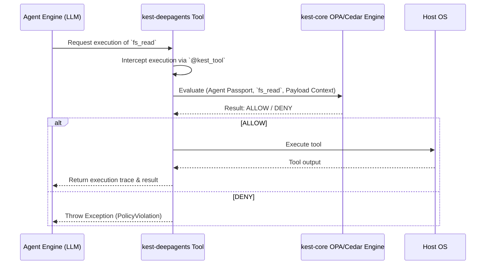

# Kest DeepAgents Architecture Design

The `kest-deepagents` package sits between the `kest-core` zero-trust framework and the execution capabilities of `deepagents`. 

## 1. Agent Orchestration Flow

## 2. Context Propagation

Context propagation in terminal agents works heavily via `opentelemetry`. 
When an Agent spawns a sub-agent, it injects the necessary context tokens. The `kest_tool` adapter retrieves this `kest.context` directly from the active span or `contextvars`.

## 3. Passport Delegation Models

To achieve granular Zero-Trust, every agent is issued a Cryptographic **Passport** initialized by `OAuthCliProvider` or generated symmetrically.
When `browser_subagent` runs, it holds a delegated scope (restricted Passport) given to it by the parent `terminal_subagent`, ensuring it can never exceed the parent's limits.
