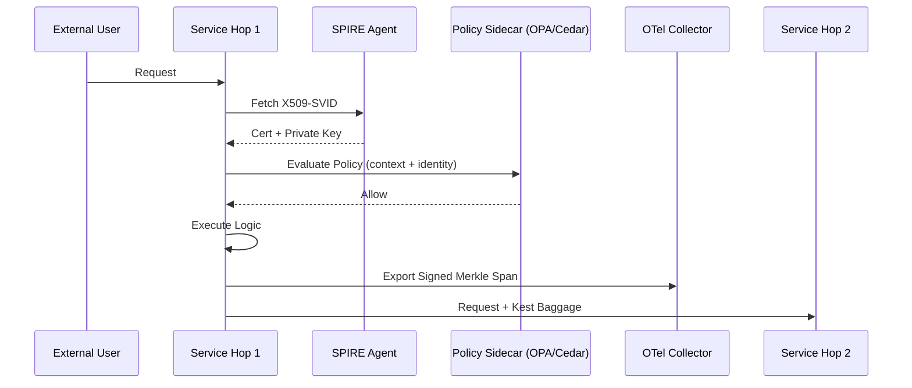
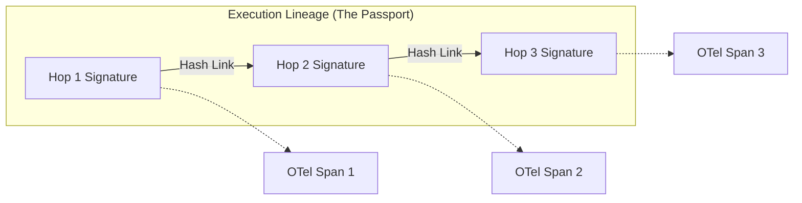

# High-Level Overview

Kest (Key + Trust) provides a cryptographically verifiable framework for distributed execution. It ensures that every action taken by a microservice is authenticated via **Workload Identity**, authorized via **Fine-Grained Policy**, and immutably recorded in a **Merkle-Linked Audit Trail**.

## The Zero Trust Request Flow

When a request enters a Kest-secured system, it undergoes continuous verification at every hop.

## Core Components

### 1. Workload Identity (SPIFFE/SPIRE)
Kest eliminates the "Secret Zero" problem. Services do not use static API keys. Instead, they attest their identity to a local SPIRE Agent to receive short-lived, dynamically rotated X509 certificates.

### 2. Policy Sidecars (ABAC)
Every hop enforces its own rules. By using local sidecars (OPA or Cedar), Kest ensures that authorization is performed with sub-millisecond latency. Policies can be **Lineage-Aware**, meaning they can inspect the entire path the request has taken.

### 3. Merkle-Linked Audit Trail
Traditional logs are fungible. Kest logs are **Non-Fungible**. Each execution span contains a cryptographic signature that links to the hash of the previous signature.

## Why Kest?

- **Non-Repudiation**: Services cannot deny their actions; every span is signed by their unique private key.
- **Tamper-Evidence**: If an attacker alters a log entry or tries to inject a fake hop, the Merkle chain breaks immediately.
- **CARTA Compliance**: Trust is calculated continuously based on the proven history of the request, not just the last hop.
