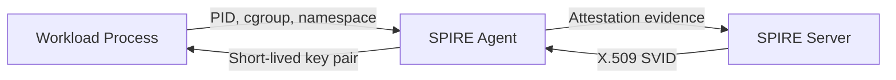

# Identity is the Perimeter

The **Secret Zero problem** is the Achilles' heel of traditional distributed security: to access a secret manager, a workload needs a secret — but where does that first secret come from?

## The Recursive Trap

Every common approach falls into the same recursion:

| Approach | The Secret Zero |
|---|---|
| Hardcoded API keys | The key itself, committed to source control |
| Vault with AppRole | The AppRole `secret_id` that bootstraps Vault access |
| AWS Secrets Manager | The IAM credentials that authenticate to Secrets Manager |
| Environment variables | Whoever sets the variable has the secret |
| CI/CD injection | The CI platform becomes a single point of compromise |

The root problem is that **identity is being asserted, not attested**. A workload says "I have this key, therefore I am authorized." But a stolen key works just as well in an attacker's hands.

## Platform Attestation: The Solution

Kest eliminates this recursion through **platform attestation** — where the infrastructure itself cryptographically vouches for the workload based on kernel-level evidence that cannot be forged:



### How SPIRE Attestation Works

1. **The SPIRE Agent** runs on each node (or as a DaemonSet in Kubernetes). It observes the workload's process attributes — PID, mount namespace, cgroup, Kubernetes pod labels, AWS instance metadata.

2. **Attestation** — The Agent sends this evidence to the SPIRE Server, which matches it against registered workload entries. No secret is exchanged — the evidence is inherent OS-level facts about the running process.

3. **SVID Issuance** — If the attestation matches, the SPIRE Server issues a short-lived **SPIFFE Verifiable Identity Document (SVID)** — an X.509 certificate encoding the workload's globally unique SPIFFE ID: `spiffe://kest.internal/workload/payment-service`.

4. **Automatic Rotation** — SVIDs expire in minutes, not months. The SPIRE Agent transparently rotates them without workload involvement.

## Identity Providers in Kest

Kest abstracts all identity sources behind the `IdentityProvider` interface (Spec §5.1):

```python
class IdentityProvider(ABC):
    @abstractmethod
    def get_workload_id(self) -> str:
        """Return the unique workload identifier (SPIFFE URI, ARN, etc.)"""

    @abstractmethod
    def sign(self, payload: bytes) -> str:
        """Sign payload → JWS compact serialization"""
```

### Production Providers

| Provider | Identity Source | Best For |
|---|---|---|
| `SPIREProvider` | SPIFFE Workload API (Unix socket) | Kubernetes, VM-based microservices |
| `AWSWorkloadIdentity` | AWS STS + KMS | ECS, EKS, Lambda on AWS |
| `BedrockAgentIdentity` | Amazon Bedrock AgentCore | AI agents on AWS |
| `OIDCIdentity` | OIDC JWT from file/env | CI/CD (GitHub Actions, GitLab) |

### Development Providers

| Provider | Purpose | Constraint |
|---|---|---|
| `LocalEd25519Provider` | Ephemeral in-process key pair | ⚠️ Warns at startup — not for production |
| `MockIdentityProvider` | Deterministic JWS for unit tests | Testing only |

### Auto-Detection

When you call `configure()` without specifying an identity provider, Kest probes the environment automatically:

```python
from kest.core import configure, MockPolicyEngine

# Auto-detects: SPIRE → AWS → OIDC → Local (fallback)
configure(engine=MockPolicyEngine(allow=True))
```

The probe order (Spec §5.9): `SPIFFE_ENDPOINT_SOCKET` → `AWS_BEDROCK_AGENT_ID` → `AWS_ROLE_ARN` → `KEST_OIDC_TOKEN_PATH` → `LocalEd25519Provider`.

## Why This Matters

With platform attestation:
- **No secrets to steal** — there are no API keys, passwords, or tokens to compromise
- **No secrets to rotate** — SVIDs auto-rotate in minutes
- **No secrets to share** — each workload gets its own cryptographic identity
- **No secrets to leak** — private keys exist only in volatile memory

This makes the *Identity is the Perimeter* principle (P1) not just a design guideline but a mathematical guarantee: you cannot participate in a Kest-verified execution chain without passing platform attestation first.

---

*See [Getting Started](/developers/guide/getting_started) for practical setup, and the [Kest v0.3.0 Spec §5.1](kest_spec_v0.3.0) for the normative interface definition.*
