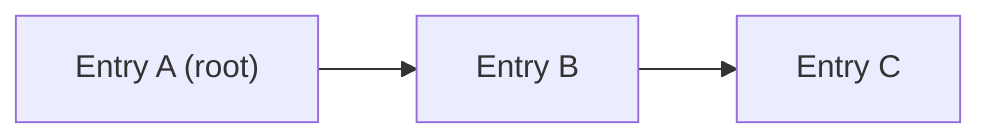
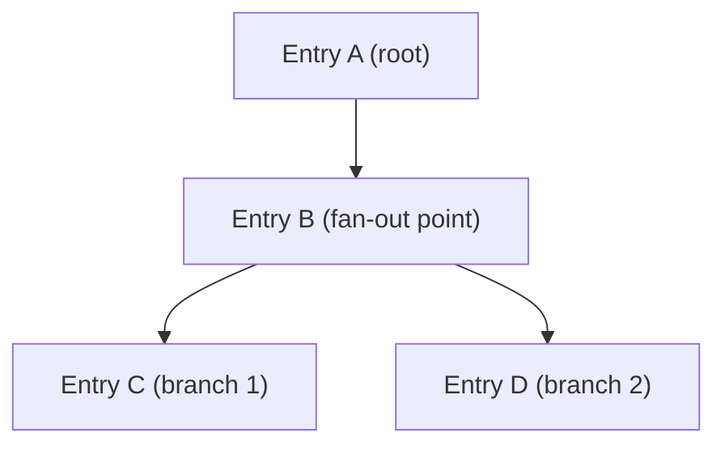
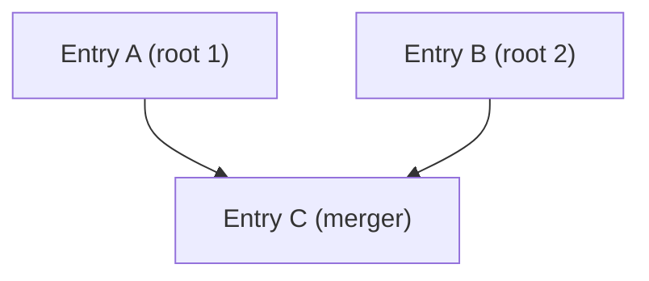
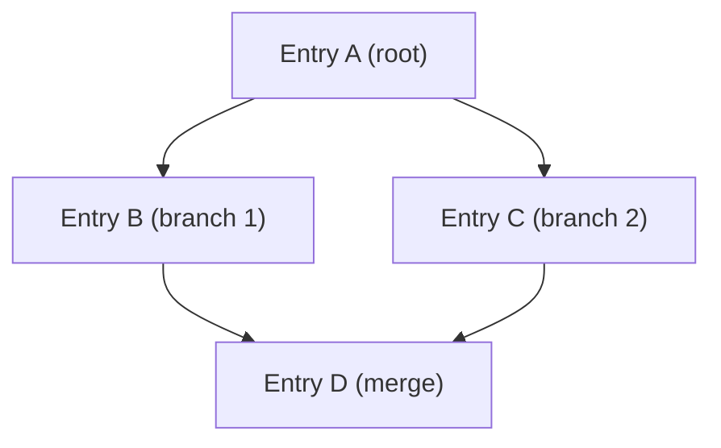
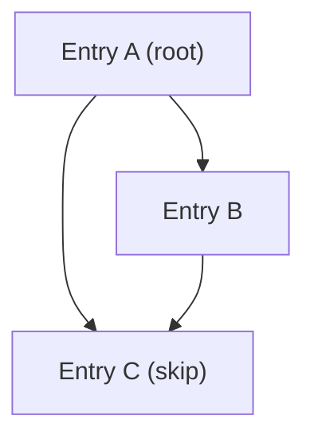
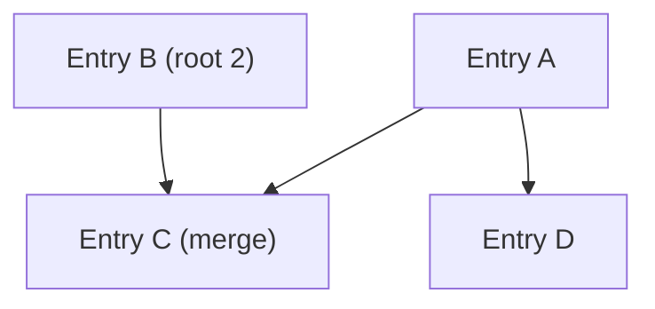
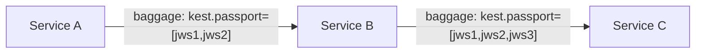

# Merkle DAG: Cryptographic Execution Lineage

An action is not trusted merely because the immediate caller is authenticated. Trust requires a **cryptographically verified chain of custody** covering the entire execution path. This is Kest's second principle (P2), and it is enforced through the **Passport** — a Merkle-linked graph of signed audit entries.

## The Passport Structure

A Passport is an ordered list of JWS (JSON Web Signature) compact strings. Each JWS encodes a `KestEntry` — the signed audit record for a single execution hop. The entries are cryptographically chained: each entry's `parent_ids` contains the SHA-256 hashes of the *previous* JWS strings its execution depended on.


### Why a Merkle DAG?

The chaining guarantees three properties:

1. **Tamper Evidence** — If any past entry is modified (even a single bit), its hash changes, which breaks every subsequent `parent_ids` link. A verifier can detect this instantly.

2. **Non-Repudiation** — Each entry is signed by the workload's private key (via JWS/EdDSA). A workload cannot deny having produced an entry.

3. **Ordering Guarantee** — The hash chain establishes a strict before/after relationship between entries, independent of wall-clock time (which can skew across nodes — see Spec §11.5).

Unlike simple Merkle chains, Kest supports a full **Directed Acyclic Graph (DAG)**. An entry's `parent_ids` is a list, enabling it to reference multiple prior entries simultaneously. This directly models how real distributed systems behave — parallel branches, convergent flows, and rich dependency graphs.

## DAG Topology Scenarios

Kest natively supports six execution topologies. Each is cryptographically verified as part of the standard `PassportVerifier.verify()` pass.

### 1. Linear (Standard Chain)

The simplest case. Each step has exactly one parent.



```python
# parent_ids with a single predecessor
entry_c = KestEntry(parent_ids=[hash_of_b], ...)
```

### 2. Fan-Out

One parent spawns multiple independent branches. Each branch creates its own sub-chain from the parent tip. Branch contexts are isolated — mutations in Branch A do not affect Branch B (see §11.7).



Fan-Out is implicit in Kest: when multiple tasks inherit the same OTel context, each creates its own independent entry with the same parent hash.

### 3. Fan-In

Multiple independent lineages converge into a single node. The convergence point is declared via `Passport.merge()` before the merger entry is created.



```python
from kest.core.models import Passport

# Combine two independent lineages
merged = Passport.merge(passport_a, passport_b)

# The next @kest_verified call will reference tip(A) and tip(B) as parents
```

`Passport.merge()` deduplicates entries and preserves topological order. The resulting passport is ready for a downstream step that depends on both branches.

### 4. Diamond

The most common real-world DAG pattern. A root fans out into parallel branches, which then fan back in. The final merger declares both branch tips as parents.



```python
# Diamond: A → B, A → C, {B,C} → D
entry_d = KestEntry(parent_ids=[hash_of_b, hash_of_c], ...)
```

### 5. Skip Connection

An entry that depends on both an immediate parent and a more distant ancestor. This is useful for workflows where a downstream step needs to directly reference a root guarantee, bypassing intermediate hops.



```python
# C depends on both A and B directly
entry_c = KestEntry(parent_ids=[hash_of_b, hash_of_a], ...)
```

### 6. Multi-Root

Multiple independent source entries with no common ancestor. This models fully independent parallel workloads that eventually converge.



---

## How Entries Are Created

When `@kest_verified` executes, the Verification Hook (Spec §5.8) performs these steps:

```python
# Step 1: Extract the current Passport from OTel context
passport = get_current_passport()  # may be empty for root

# Step 2: Compute parent_ids from all active chain tips
active_tips = get_active_tips()  # comma-separated from kest.chain_tip baggage
if active_tips:
    parent_ids = [sha256(tip_jws).hexdigest() for tip_jws in active_tips]
else:
    parent_ids = ["0"]  # sentinel for chain root

# Step 3: Build the KestEntry payload
payload = {
    "entry_id": uuid7(),           # RFC 9562 time-ordered UUID
    "operation": "process_payment",
    "trust_score": 40,
    "parent_ids": parent_ids,      # list — supports multi-parent DAG nodes
    "taints": ["user_input"],
    "labels": {
        "principal": "spiffe://kest.internal/workload/payment-svc",
        "trace_id": "4bf92f3577b34da6a3ce929d0e0e4736"
    },
    # ... remaining fields per §4.1
}

# Step 4: Canonicalize (RFC 8785) and sign (EdDSA/JWS)
canonical_bytes = jcs_canonicalize(payload)
jws = identity.sign(canonical_bytes)  # → "header.payload.signature"

# Step 5: Append to Passport
passport.add_signature(jws)
```

## The JWS Format

Every entry is serialized as a JWS compact string with three dot-separated, base64url-encoded segments:

```
eyJhbGciOiJFZERTQSIsInR5cCI6IkpXUyJ9.eyJlbnRyeV9pZCI6Ii4uLiJ9.signature
│────────── header ──────────│──── payload ────│─ signature ─│
```

- **Header**: `{"alg":"EdDSA","typ":"JWS"}` — always Ed25519
- **Payload**: RFC 8785-canonicalized KestEntry JSON
- **Signature**: Ed25519 signature of `base64url(header).base64url(payload)`

### RFC 8785: Why Canonicalization Matters

JSON objects are unordered by specification. `{"a":1,"b":2}` and `{"b":2,"a":1}` are semantically identical but produce different byte strings — and therefore different signatures. RFC 8785 (JSON Canonicalization Scheme) mandates:

- Keys sorted lexicographically by Unicode code points
- No whitespace outside strings
- Numbers in shortest round-trip representation

This ensures **byte-identical output** across all conformant implementations, which is the foundation of polyglot interoperability (Principle P6).

## Verification

The `PassportVerifier` validates an entire Passport in a **single pass** (Spec §6.2). It supports all DAG topologies using a set-based seen-hash approach:

```python
from kest.core import Passport, PassportVerifier

passport = Passport.deserialize(serialized_data)
PassportVerifier.verify(passport, providers={
    "spiffe://kest.internal/workload/api-gw": api_gw_provider,
    "spiffe://kest.internal/workload/payment-svc": payment_provider,
})
```

The algorithm:

1. Initialize `seen_hashes = {"0"}` (the sentinel root is always valid)
2. For each JWS in the passport (in topological order):
   - Parse the payload
   - Assert **all** `parent_ids` are present in `seen_hashes`
   - Verify the JWS signature against the workload's public key
   - Compute `sha256(jws)` and add it to `seen_hashes`
3. If all checks pass, the entire DAG is cryptographically proven unaltered

> **Topological Contract**: Passport entries MUST be ordered such that every parent appears before its child. `Passport.merge()` guarantees this automatically.

### What Breaks the Chain

| Attack | Detection |
|---|---|
| Modify a past entry's payload | SHA-256 hash mismatch — orphaned `parent_ids` reference |
| Delete an entry from the middle | `parent_ids` reference not found in `seen_hashes` |
| Reorder entries | Parent not yet seen when child is processed |
| Forge a new entry | JWS signature verification failure (wrong private key) |
| Replay an old Passport | Entry timestamps and UUIDs won't match expected context |
| Inject a false merge node | `parent_ids` references unknown hashes |

## Combining Lineages with `Passport.merge()`

When parallel branches need to converge, use `Passport.merge()`:

```python
from kest.core.models import Passport

# branch_a.entries = [sig_root, sig_branch_a]
# branch_b.entries = [sig_root, sig_branch_b]

merged = Passport.merge(branch_a, branch_b)
# merged.entries = [sig_root, sig_branch_a, sig_branch_b]
# → Deduplicated (sig_root appears once) and topologically ordered
```

`Passport.merge()` guarantees:
- **No duplicates** — entries that appear in multiple passports are included only once
- **Insertion order preserved** — earlier entries (by original position) retain their relative order
- **Valid for verification** — `PassportVerifier.verify()` can process the result directly

## Propagation Across Services

The Passport travels with the request via **W3C Baggage** HTTP headers (Spec §8). The active chain tip (or tips for multi-parent merges) is tracked separately:

```http
baggage: kest.passport=["header.payload.sig1","header.payload.sig2"],kest.chain_tip=<hash1>,<hash2>
```

For Fan-In scenarios, `kest.chain_tip` carries a comma-separated list of parent hashes:

```http
baggage: kest.chain_tip=sha256(branch_a_jws),sha256(branch_b_jws)
```

When the serialized Passport exceeds 4KB, the **Claim Check** pattern kicks in — the full Passport is stored in a `CacheProvider` and only a UUID reference travels in the header.



---

*For the full data model, see [Audit Entry](audit_entry). For the normative algorithm, see [Spec §6.2](kest_spec_v0.3.0). For DAG edge case handling, see [Edge Cases §11.8](edge_cases).*
