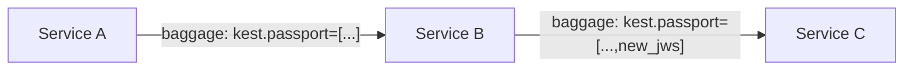

# Lineage Over Assertion

An action is not trusted merely because the immediate caller is authenticated. Trust requires a **cryptographically verified chain of custody** covering the entire execution path. This is Kest's second principle (P2), and it is enforced through the **Passport** — a Merkle-linked chain of signed audit entries.

## The Passport Structure

A Passport is an ordered list of JWS (JSON Web Signature) compact strings. Each JWS encodes a `KestEntry` — the signed audit record for a single execution hop. The entries are cryptographically chained: each entry's `parent_ids[0]` contains the SHA-256 hash of the *previous* JWS string.


### Why a Merkle Chain?

The chaining guarantees three properties:

1. **Tamper Evidence** — If any past entry is modified (even a single bit), its hash changes, which breaks every subsequent `parent_ids` link. A verifier can detect this instantly.

2. **Non-Repudiation** — Each entry is signed by the workload's private key (via JWS/EdDSA). A workload cannot deny having produced an entry.

3. **Ordering Guarantee** — The hash chain establishes a strict before/after relationship between entries, independent of wall-clock time (which can skew across nodes — see Spec §11.5).

## How Entries Are Created

When `@kest_verified` executes, the Verification Hook (Spec §5.8) performs these steps to create and chain a new entry:

```python
# Step 1: Extract the current Passport from OTel context
passport = get_current_passport()  # may be empty for root

# Step 2: Compute parent_ids
if passport.entries:
    last_jws = passport.entries[-1]
    parent_hash = sha256(last_jws.encode('utf-8')).hexdigest()
else:
    parent_hash = "0"  # sentinel for chain root

# Step 3: Build the KestEntry payload
payload = {
    "entry_id": uuid7(),           # RFC 9562 time-ordered UUID
    "operation": "process_payment",
    "trust_score": 40,
    "parent_ids": [parent_hash],
    "taints": ["user_input"],
    "labels": {
        "principal": "spiffe://kest.internal/workload/payment-svc",
        "trace_id": "4bf92f3577b34da6a3ce929d0e0e4736"
    },
    # ... remaining fields per §4.1
}

# Step 4: Canonicalize (RFC 8785) and sign (EdDSA/JWS)
canonical_bytes = jcs_canonicalize(payload)
jws = identity.sign(canonical_bytes)  # → "header.payload.signature"

# Step 5: Append to Passport
passport.add_signature(jws)
```

## The JWS Format

Every entry is serialized as a JWS compact string with three dot-separated, base64url-encoded segments:

```
eyJhbGciOiJFZERTQSIsInR5cCI6IkpXUyJ9.eyJlbnRyeV9pZCI6Ii4uLiJ9.signature
│────────── header ──────────│──── payload ────│─ signature ─│
```

- **Header**: `{"alg":"EdDSA","typ":"JWS"}` — always Ed25519
- **Payload**: RFC 8785-canonicalized KestEntry JSON
- **Signature**: Ed25519 signature of `base64url(header).base64url(payload)`

### RFC 8785: Why Canonicalization Matters

JSON objects are unordered by specification. `{"a":1,"b":2}` and `{"b":2,"a":1}` are semantically identical but produce different byte strings — and therefore different signatures. RFC 8785 (JSON Canonicalization Scheme) mandates:

- Keys sorted lexicographically by Unicode code points
- No whitespace outside strings
- Numbers in shortest round-trip representation

This ensures **byte-identical output** across all conformant implementations, which is the foundation of polyglot interoperability (Principle P6).

## Verification

The `PassportVerifier` validates an entire Passport in a single pass (Spec §6.2):

```python
from kest.core import Passport, PassportVerifier

passport = Passport.deserialize(serialized_data)
PassportVerifier.verify(passport, providers={
    "spiffe://kest.internal/workload/api-gw": api_gw_provider,
    "spiffe://kest.internal/workload/payment-svc": payment_provider,
})
```

The algorithm:

1. Initialize `last_hash = "0"`
2. For each JWS in the chain:
   - Parse the payload
   - Assert `payload.parent_ids[0] == last_hash`
   - Verify the JWS signature against the workload's public key
   - Compute `last_hash = sha256(jws)`
3. If all checks pass, the entire lineage is cryptographically proven unaltered

### What Breaks the Chain

| Attack | Detection |
|---|---|
| Modify a past entry's payload | SHA-256 hash mismatch at the next entry |
| Delete an entry from the middle | Hash chain break — successor's `parent_ids` is orphaned |
| Reorder entries | Hash chain break — wrong `parent_ids` at every permuted position |
| Forge a new entry | JWS signature verification failure (wrong private key) |
| Replay an old Passport | Entry timestamps and UUIDs won't match expected context |

## Propagation Across Services

The Passport travels with the request via **W3C Baggage** HTTP headers (Spec §8):

```http
baggage: kest.passport=["header.payload.sig1","header.payload.sig2"]
```

When the serialized Passport exceeds 4KB, the **Claim Check** pattern kicks in — the full Passport is stored in a `CacheProvider` and only a UUID reference travels in the header.



---

*For the full data model, see [Audit Entry](audit_entry). For the normative algorithm, see [Spec §6.2](kest_spec_v0.3.0).*
