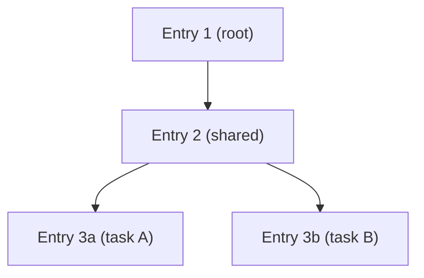

# Fail-Secure by Default

Kest's fourth principle (P4) mandates that **any failure mode must result in denial**, not a degraded-but-allowed path. This article documents every edge case the spec addresses and how Kest handles each one.

## Edge Case Matrix

| Scenario | Behaviour | Spec Reference |
|---|---|---|
| Policy sidecar unreachable | Deny immediately | §11.1 |
| Identity provider unavailable | Halt — no fallback signing | §11.2 |
| Oversized Passport (>4KB) | Claim Check pattern | §11.3 |
| Claim Check UUID not in cache | Exception — do NOT proceed | §11.4 |
| Clock skew between nodes | Timestamps informational only | §11.5 |
| Empty policy list | Reject at configuration time | §11.6 |
| Concurrent async execution | Task-local context isolation | §11.7 |

## Policy Sidecar Unreachable (§11.1)

**Condition**: TCP connection refused, HTTP timeout, or non-200 response from OPA/Cedar.

**Required behaviour**: Immediately treat as denial. Raise an authorization error that halts the protected operation. Do NOT retry automatically — retry policy is the operator's responsibility at the infrastructure layer.

```python
# This will raise an exception, NOT allow execution
@kest_verified(policy="kest/allow_trusted")
def critical_operation():
    ...  # Never executes if OPA is down
```

The `timeout` parameter controls how long to wait (default: 1.0 seconds):

```python
engine = OPAPolicyEngine(host="localhost", port=8181, timeout=0.5)
```

**Why no automatic retry?** A retry would introduce latency variance and mask infrastructure problems. If the sidecar is down, the operator should be alerted through standard health monitoring — not silently retried until it comes back. Retrying also creates a window where an attacker could race a malicious request through during the instability.

## Identity Provider Unavailable (§11.2)

**Condition**: SPIFFE socket not found, AWS KMS API error, OIDC token file missing.

**Required behaviour**: Raise an error during initialization or during `sign()`. The Verification Hook propagates this upward, preventing execution.

**No fallback signing**: The implementation MUST NOT fall back to an unsigned audit entry. An unsigned entry would violate Principle P3 (Non-Fungible Audit) — it could be forged by any process.

## Oversized Passport — Claim Check (§11.3)

**Condition**: Serialized Passport exceeds 4096 bytes (configurable).

**Required behaviour**: Engage the Claim Check pattern. The full Passport is stored in a `CacheProvider` under a UUID key, and only the UUID travels in the baggage header.

```python
from kest.core import configure, SimpleCache

configure(
    cache=SimpleCache(ttl=300),  # 5-minute TTL
    # ...
)
```

How it works:

```
# Normal: baggage: kest.passport=["jws1","jws2","jws3"]
# Claim Check: baggage: kest.claim_check=550e8400-e29b-41d4-a716-446655440000
```

The downstream service retrieves the full Passport from the cache using the UUID, restoring the complete Merkle chain before the Verification Hook executes.

**If no `CacheProvider` is configured** and the Passport exceeds the threshold, a configuration error is raised — the system does not silently truncate the Passport.

## Claim Check Not Found (§11.4)

**Condition**: Downstream receives `kest.claim_check` but the UUID is not in the cache (expired TTL or cache restart).

**Required behaviour**: Raise an exception. Do NOT proceed with an empty Passport — this would break the Merkle chain and create an orphaned sub-chain with no verifiable history.

**Mitigation**: Set the cache TTL long enough to outlive the full request chain. For most systems, 5 minutes is sufficient. For long-running workflows, consider extending to 30 minutes or using a durable cache (Redis, DynamoDB).

## Clock Skew (§11.5)

**The `timestamp_ms` field MUST NOT be used for validating execution order.**

Order is determined exclusively by the cryptographic `parent_ids` hash linkage. Timestamps are informational only — for human inspection and approximate forensic timing.

This means:
- A node with `timestamp_ms = 100` can have a child with `timestamp_ms = 99` if the child's clock is slightly behind
- Verification will pass as long as the hash chain is correct
- Audit tools should rely on the Merkle chain for ordering, using timestamps only as approximations

**Why?** In distributed systems, clock synchronization (NTP) provides millisecond-level accuracy at best, and can drift significantly during network partitions. Relying on timestamps for security ordering would create false negatives (rejecting valid chains due to clock skew) or false positives (accepting out-of-order chains that happen to have monotonic timestamps).

## Empty Policy List (§11.6)

**Condition**: `@kest_verified` called with an empty policy list.

**Required behaviour**: Reject at configuration time (raise an error), not at execution time.

```python
# This raises an error immediately — not at first invocation
@kest_verified(policy=[])  # ← Configuration error
def my_function():
    ...
```

**Why at configuration time?** Catching misconfiguration early prevents a deployed service from running without any policy enforcement. A service with an empty policy list would allow all operations — violating the fundamental premise of Zero Trust.

## Concurrent Execution (§11.7)

**Condition**: Multiple async tasks or threads executing concurrently.

**Required behaviour**: The Kest context (Passport, baggage) MUST be scoped to the current async task or thread. Concurrent tasks MUST NOT share a mutable Passport.

```python
import asyncio

async def main():
    # Each task gets its own Passport context
    await asyncio.gather(
        process_order("order-1"),  # Passport A
        process_order("order-2"),  # Passport B — independent
    )
```

This is implemented using Python's `contextvars.ContextVar` via the OTel Context API — each async task inherits a snapshot of the parent context, and mutations are local to the task.

If concurrent tasks branch from the same parent, each creates an independent sub-chain rooted at the last shared entry:



---

*For the full normative edge-case handling, see [Spec §11](kest_spec_v0.3.0).*
