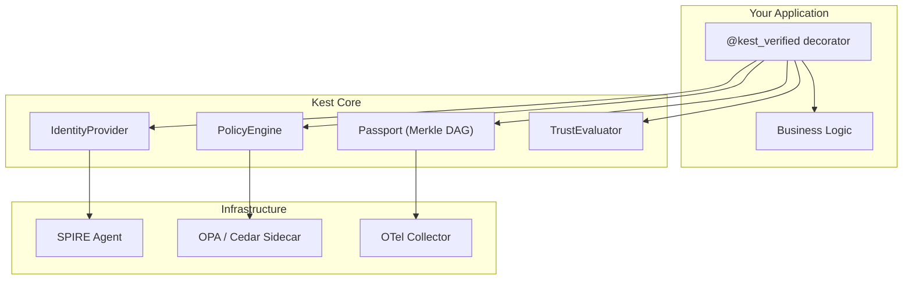

# Developer Guide

Welcome to the Kest Developer Guide. This section takes you from zero to a fully secured, policy-enforced, cryptographically audited microservice in Python.

## Learning Path

| Step | Article | What You'll Learn |
|---|---|---|
| 1 | [Getting Started](getting_started) | Installation, configuration, your first `@kest_verified` function |
| 2 | [Decorators Reference](decorators) | Every `@kest_verified` parameter, the 13-step lifecycle |
| 3 | [Distributed Propagation](middleware) | Middleware stack, `KestMiddleware`, `KestHttpxInterceptor`, Claim Check |
| 4 | [Trust Model](trust_model) | CARTA trust scores, degradation, sanitizers, `ORIGIN_TRUST_MAP` |
| 5 | [Identity & Context](identity_context) | Identity providers, user/agent/task context, auto-detection |
| 6 | [Telemetry & Visualization](telemetry) | OTel setup, exporters, `kest-viz` CLI |
| 7 | [Testing & Kest Lab](testing) | `MockPolicyEngine`, unit tests, the kest-lab integration environment |
| 8 | [Kest Lab Deep Dive](kest_lab) | Docker Compose architecture, SPIRE, OPA, Cedar, Keycloak, 17 integration tests |
| 9 | [3-Hop Distributed Verification](distributed_verification) | Example: Verifying cryptographic lineage across three distinct distributed services |
| 10 | [Scope-Delegated Gateway E2E](gateway_e2e) | Example: Full Zero Trust delegation flow with token contents and policy context |

## Prerequisites

- **Python 3.11+** (the reference implementation)
- **pip** or **uv** for package management
- **Docker & Docker Compose** (for kest-lab integration tests)
- Basic familiarity with REST APIs and microservices

## Architecture at a Glance



## Quick Start

```python
from kest.core import configure, MockPolicyEngine, kest_verified

# 1. Configure (once at startup)
configure(engine=MockPolicyEngine(allow=True))

# 2. Protect your function
@kest_verified(policy="kest/allow_trusted", source_type="internal")
def process_data(payload: dict):
    return {"status": "processed", "items": len(payload)}

# 3. Call it normally
result = process_data({"key": "value"})
```

That's it. Kest handles identity, signing, policy evaluation, Merkle chain linkage, and OTel emission automatically.

---

*Ready to begin? Start with [Getting Started](getting_started).*
