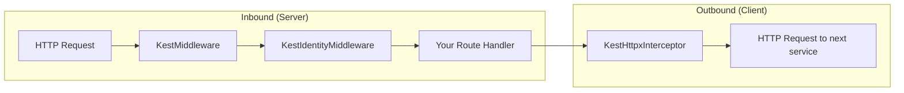
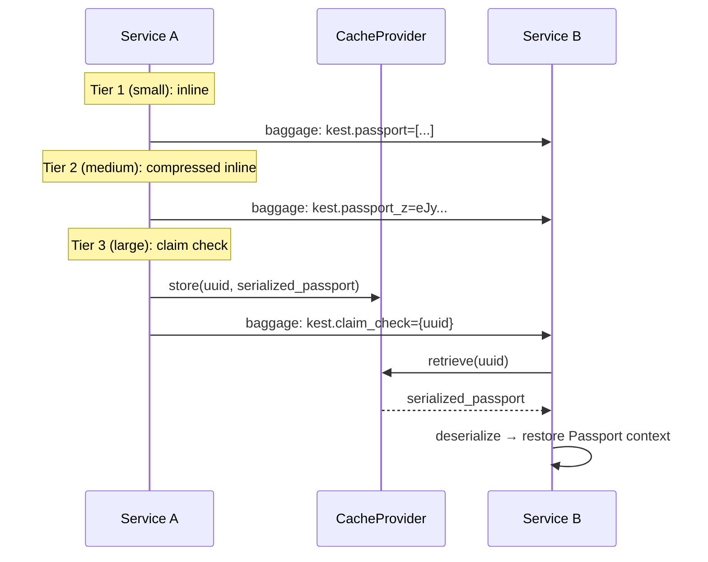

# Distributed Context Propagation

For Kest's Merkle DAG lineage to survive across microservice boundaries, the cryptographic state (Passport and lineage root) must be extracted from outgoing requests and injected into incoming requests. Kest achieves this using **W3C Baggage** headers and the OpenTelemetry Context API.

## Middleware Stack Overview



## KestMiddleware — Inbound Extraction

`KestMiddleware` extracts the Kest Passport and lineage root from incoming HTTP headers and injects them into the current OTel context:

```python
from fastapi import FastAPI
from kest.core import KestMiddleware

app = FastAPI()
app.add_middleware(KestMiddleware)
```

### What It Does

1. Looks for `baggage` header in the incoming request
2. Extracts `kest.passport` and `kest.lineage_root` values
3. Deserializes the Passport (or resolves a Claim Check UUID from cache)
4. Sets the OTel context so that `@kest_verified` functions inherit the chain

### Header Format

```http
GET /api/process HTTP/1.1
Host: service-b.internal
baggage: kest.passport=["header.payload.sig1","header.payload.sig2"],kest.lineage_root=abc123
```

### Baggage Propagation Tiers

Kest uses a three-tier strategy to propagate the Passport without exceeding HTTP header limits:

| Tier | Header key | When used |
|---|---|---|
| 1 — Inline | `kest.passport` | Passport ≤ 4 KB uncompressed |
| 2 — Compressed Inline | `kest.passport_z` | zlib-compressed Passport ≤ 4 KB |
| 3 — Claim Check | `kest.claim_check` | Exceeds both thresholds |

A 10-hop chain (~5 KB raw) typically compresses to ~1.5 KB and travels as `kest.passport_z` without any cache dependency. Only incompressible or very deep chains (50+ hops) use the Claim Check path.

```http
# Tier 1 — small passport, inline
baggage: kest.passport=%5B%22header.payload.sig%22%5D,kest.chain_tip=abc123

# Tier 2 — compressed inline (zlib, base64url)
baggage: kest.passport_z=eJyLjgUAAX8Bf...,kest.chain_tip=abc123

# Tier 3 — claim check UUID
baggage: kest.claim_check=550e8400-e29b-41d4-a716-446655440000,kest.chain_tip=abc123
```

## KestIdentityMiddleware — Token Extraction

If your gateway authenticates users via JWT (from Keycloak, Auth0, etc.), `KestIdentityMiddleware` extracts the user identity and sets it as context:

```python
from kest.core.ext import KestIdentityMiddleware

app.add_middleware(
    KestIdentityMiddleware,
    jwks_uri="https://keycloak.internal/realms/kest/protocol/openid-connect/certs"
)
```

This stores the JWT claims in the OTel context so that `@kest_verified` functions can access them via `get_current_user()` / `get_current_agent()` / `get_current_task()` without explicit extraction.

> ⚠️ **JWT verification guard:** If `jwks_uri` is not provided, `KestIdentityMiddleware` raises `RuntimeError` on the first request to prevent silent unverified JWT decoding. In development, set `KEST_INSECURE_NO_VERIFY=true` to bypass this guard.

## Middleware Ordering

Middleware executes in **reverse order of `add_middleware()` calls** in frameworks like FastAPI/Starlette. The correct ordering is:

```python
app = FastAPI()

# Order matters: KestIdentityMiddleware wraps KestMiddleware
app.add_middleware(KestIdentityMiddleware)  # Outer (runs first)
app.add_middleware(KestMiddleware)          # Inner (runs second)
```

Execution order for an inbound request:
1. `KestIdentityMiddleware` → extracts user JWT
2. `KestMiddleware` → extracts Passport from baggage
3. Your route handler → `@kest_verified` has both user and Passport

## KestHttpxInterceptor — Outbound Propagation

When your service calls another service, `KestHttpxInterceptor` ensures the Passport and lineage root travel with the outbound request:

```python
import httpx
from kest.core import KestHttpxInterceptor

async def call_downstream():
    async with httpx.AsyncClient(
        event_hooks={"request": [KestHttpxInterceptor.inject_context]}
    ) as client:
        response = await client.post(
            "http://service-b/api/process",
            json={"data": "..."}
        )
```

### What It Does

1. Reads the current Passport from OTel context
2. Serializes it (or creates a Claim Check if oversized)
3. Injects `kest.passport` and `kest.lineage_root` into the outbound `baggage` header

### With `requests` Library

```python
import requests
from kest.core.ext import inject_kest_headers

headers = inject_kest_headers({})
response = requests.post(
    "http://service-b/api/process",
    json={"data": "..."},
    headers=headers
)
```

## BaggageManager

The `BaggageManager` handles the low-level serialization and deserialization of Kest-specific baggage:

```python
from kest.core import BaggageManager

# Write Passport to OTel baggage
BaggageManager.set_passport(passport)

# Read Passport from OTel baggage
passport = BaggageManager.get_passport()

# Handle Claim Check
BaggageManager.set_claim_check(uuid_str)
claim_check = BaggageManager.get_claim_check()
```

### Claim Check Pattern

When a Passport exceeds the maxBaggageBytes threshold:



## Full Example: 3-Service Chain

```python
# === Service A (API Gateway) ===
from fastapi import FastAPI
from kest.core import configure, OPAPolicyEngine, KestMiddleware, kest_verified
from kest.core.ext import KestIdentityMiddleware

app = FastAPI()
app.add_middleware(KestIdentityMiddleware)
app.add_middleware(KestMiddleware)

configure(engine=OPAPolicyEngine(host="localhost", port=8181))

@app.post("/api/orders")
@kest_verified(
    policy="kest/allow_trusted",
    source_type="authenticated_user",
    user=lambda: get_user_from_context()
)
async def create_order(order: dict):
    # Call downstream service — Passport propagates automatically
    async with httpx.AsyncClient(
        event_hooks={"request": [KestHttpxInterceptor.inject_context]}
    ) as client:
        result = await client.post(
            "http://payment-service/api/charge",
            json=order
        )
    return result.json()


# === Service B (Payment Service) ===
from fastapi import FastAPI
from kest.core import configure, OPAPolicyEngine, KestMiddleware, kest_verified

app = FastAPI()
app.add_middleware(KestMiddleware)

configure(engine=OPAPolicyEngine(host="localhost", port=8181))

@app.post("/api/charge")
@kest_verified(
    policy="kest/payments_policy",
    source_type="internal"
)
async def charge_payment(order: dict):
    # Passport now has 2 entries: [gateway_jws, payment_jws]
    return process_charge(order)
```

---

*For edge cases (oversized passports, missing claim checks), see [Fail-Secure by Default](/concepts/design/edge_cases). For the full specification, see [Spec §8](../concepts/design/kest_spec_v0.3.0).*
