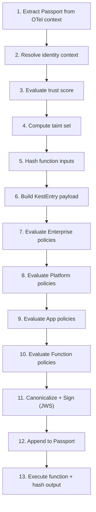

# Securing Execution (Decorators)

The `@kest_verified` decorator is the primary entry point for securing any Python function with Kest. It orchestrates identity verification, trust evaluation, policy enforcement, cryptographic signing, and Merkle chain linkage — all transparently.

## Complete Parameter Reference

```python
@kest_verified(
    policy: str | list[str],           # Policy name(s) for evaluation
    engine: PolicyEngine | None,       # Override the global engine
    identity: IdentityProvider | None, # Override the global identity
    source_type: str = "internal",     # Data origin type (trust lookup)
    trust_override: int | None = None, # Direct trust score (0-100)
    added_taints: list[str] = [],      # Taint labels to add
    removed_taints: list[str] = [],    # Taint labels to remove (sanitizer)
    user: Any | Callable = None,       # User identity (value or callable)
    agent: Any | Callable = None,      # Agent identity (value or callable)
    task: Any | Callable = None,       # Task identifier (value or callable)
    resource_attr: dict | Callable = None,  # Resource attributes for ABAC
)
```

### Parameter Deep Dive

#### `policy` — What rules to evaluate

```python
# Single policy
@kest_verified(policy="kest/allow_trusted")

# Multiple policies (logical AND — all must pass)
@kest_verified(policy=["kest/allow_trusted", "kest/check_budget"])
```

The policy name maps to a Rego package (OPA) or a Cedar policy name. Evaluation is delegated to the configured `PolicyEngine`.

#### `engine` / `identity` — Per-function overrides

Override the global configuration for specific functions that require a different engine or identity:

```python
cedar_engine = CedarPolicyEngine(host="localhost", port=8180)

@kest_verified(
    policy="process_payment",
    engine=cedar_engine  # This function uses Cedar; others use OPA
)
def process_payment(amount: float):
    ...
```

#### `source_type` — Where the data came from

Maps to `ORIGIN_TRUST_MAP` for trust score lookup:

```python
@kest_verified(policy="allow", source_type="user_input")      # trust=40
@kest_verified(policy="allow", source_type="system")           # trust=100
@kest_verified(policy="allow", source_type="adversarial")      # trust=0
```

#### `trust_override` — Explicit trust assignment

Bypasses the normal propagation rules. Use for sanitizers:

```python
@kest_verified(
    policy="allow",
    source_type="user_input",
    trust_override=80,           # Sanitized data is now trusted
    removed_taints=["user_input"]
)
def sanitize(data: dict) -> dict:
    return deep_validate(data)
```

#### `added_taints` / `removed_taints` — Risk tracking

```python
@kest_verified(
    policy="allow",
    added_taints=["contains_pii", "financial_data"],
)
def receive_payment_form(form: dict):
    ...

@kest_verified(
    policy="allow",
    removed_taints=["contains_pii"],  # PII has been redacted
)
def redact_and_forward(data: dict):
    ...
```

#### `user`, `agent`, `task` — Identity context

Accept values or **callables** for request-scoped resolution:

```python
from flask import g

@kest_verified(
    policy="kest/check_access",
    user=lambda: g.current_user,    # Resolved at call time
    agent="checkout-service",        # Static value
    task=lambda: f"order-{g.request_id}",
)
def process_checkout():
    ...
```

#### `resource_attr` — ABAC resource attributes

```python
@kest_verified(
    policy="kest/data_access",
    resource_attr=lambda: {
        "document_id": request.args.get("doc_id"),
        "sensitivity": lookup_sensitivity(request.args.get("doc_id")),
    }
)
def read_document(doc_id: str):
    ...
```

## The 13-Step Verification Lifecycle

When a `@kest_verified` function is called, the decorator executes this precise sequence:



### Failure Points

| Step | Failure | Result |
|---|---|---|
| 1 | Claim Check UUID missing from cache | Exception — halt |
| 3 | Unknown source_type | Exception — halt |
| 7–10 | Any policy denies | Authorization error — halt |
| 11 | Identity provider unavailable | Exception — halt |

**The function body never executes if any step before step 12 fails.** (Principle P4 — Fail-Secure)

## Async Support

`@kest_verified` works with both sync and async functions:

```python
@kest_verified(policy="kest/allow_trusted")
async def async_process(data: dict):
    result = await external_service.call(data)
    return result
```

Each async task maintains its own Passport context via `contextvars.ContextVar`, preventing cross-contamination between concurrent tasks.

## Return Value Transparency

The decorator is transparent — it returns exactly what your function returns:

```python
@kest_verified(policy="allow", source_type="internal")
def compute(x: int, y: int) -> int:
    return x + y

result = compute(3, 4)
assert result == 7  # Decorator doesn't alter the return value
```

## Error Handling

```python
from kest.core.engine import PolicyDeniedError

try:
    result = protected_function()
except PolicyDeniedError as e:
    print(f"Policy {e.policy} denied: {e.reason}")
except Exception as e:
    print(f"Kest error: {e}")
```

---

*For trust model details, see [Trust Model](trust_model). For policy authoring, see [Policy as Code](/blog/design/abac_policy).*
