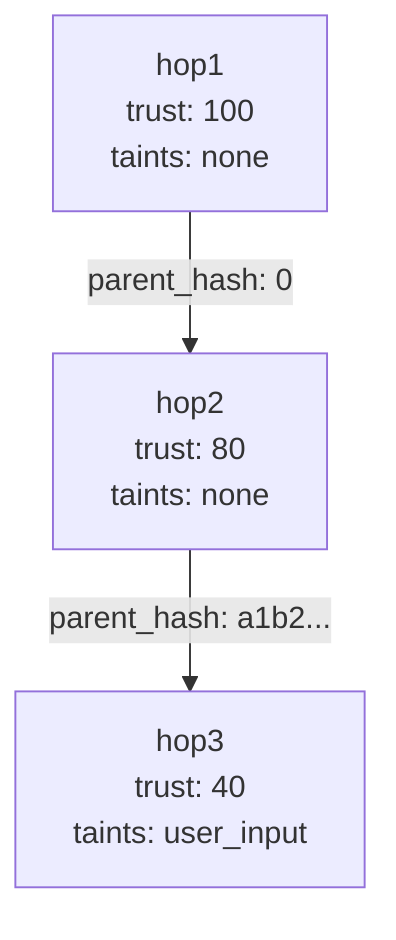

# Cryptographic Lineage Visualization

Understanding the non-fungible audit trail of a distributed request can be complex when looking at raw cryptographic hashes and signatures. Kest provides built-in telemetry integration and a CLI visualization tool to make the Merkle chain inspectable.

## Telemetry Setup

Kest emits OpenTelemetry spans for every `@kest_verified` invocation. Each span contains the KestEntry as structured attributes.

### Enabling Telemetry

```python
from kest.core.telemetry import KestTelemetry

# Initialize with a console exporter (development)
KestTelemetry.setup(
    service_name="my-service",
    exporter="console"
)
```

### Exporter Options

| Exporter | Use Case | Configuration |
|---|---|---|
| `"console"` | Development — print spans to stdout | Default |
| `"otlp"` | Production — send to OTel Collector | `endpoint="http://localhost:4317"` |
| `"jaeger"` | Jaeger-compatible backend | `endpoint="http://localhost:14268"` |
| Custom | Any OTel-compatible SDK exporter | Pass a `SpanExporter` instance |

### OTLP Configuration

```python
KestTelemetry.setup(
    service_name="payment-service",
    exporter="otlp",
    endpoint="http://otel-collector:4317",
    insecure=True  # For development without TLS
)
```

### Span Attributes

Each emitted span includes:

| Attribute | Value |
|---|---|
| `kest.entry_id` | UUID of the KestEntry |
| `kest.operation` | Name of the decorated function |
| `kest.trust_score` | Trust score for this hop |
| `kest.principal` | Workload identifier |
| `kest.taints` | Comma-separated taint list |
| `kest.parent_hash` | SHA-256 linking to previous entry |
| `kest.signature` | The full JWS compact string |

## kest-viz: CLI Visualization

`kest-viz` parses collected OTel spans and generates a Mermaid.js diagram of the Merkle DAG:

### Usage

```bash
# From exported trace data (JSON)
kest-viz --input trace.json --output diagram.md

# From a running OTel Collector (OTLP/gRPC)
kest-viz --endpoint http://localhost:4317 --trace-id abc123
```

### Example Output

The generated Mermaid diagram shows the execution chain with trust scores, taints, and hash linkage:



### Interpreting the Diagram

- **Nodes** represent individual KestEntries (one per `@kest_verified` call)
- **Edges** show `parent_ids` hash linkage (the Merkle chain)
- **Trust scores** show degradation through the chain
- **Taints** show cumulative risk labels

## Integration with Jaeger

When using the OTLP exporter with a Jaeger backend, Kest execution chains appear as distributed traces:

```python
KestTelemetry.setup(
    service_name="my-service",
    exporter="otlp",
    endpoint="http://jaeger:4317"
)
```

Each `@kest_verified` call creates a span within the same trace, connected by parent-child relationships. The span attributes contain all the cryptographic verification data — making Jaeger a powerful visual debugger for Kest chains.

## Programmatic Access

Access spans programmatically for custom tooling:

```python
from kest.core.telemetry import KestTelemetry

# Get all spans from the current trace
spans = KestTelemetry.get_recorded_spans()

for span in spans:
    print(f"  Operation: {span.attributes['kest.operation']}")
    print(f"  Trust: {span.attributes['kest.trust_score']}")
    print(f"  Hash: {span.attributes['kest.parent_hash']}")
```

---

*For the integration test environment that uses all telemetry features, see [Kest Lab Deep Dive](kest_lab). For the OTel specification, see [Spec §10](../concepts/design/kest_spec_v0.3.0).*
