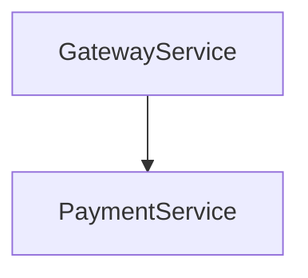

# Cryptographic Lineage Visualization

Understanding the non-fungible audit trail of a distributed request can be complex when looking at raw cryptographic hashes and signatures. Kest v0.3.0 introduces a built-in CLI tool, `kest-viz`, to parse OpenTelemetry spans and generate a simple Merkle DAG visualization using Mermaid.js syntax.

## Prerequisites

To use `kest-viz`, ensure you are exporting Kest telemetry to either a local file or a SQLite database during execution:

```python
from kest.core.telemetry import KestTelemetry

# Initialize OTel to write telemetry to a local JSON file
KestTelemetry.setup("my-service", exporter_type="file", endpoint="kest_audit.json")
```

Or a SQLite database:

```python
KestTelemetry.setup("my-service", exporter_type="sqlite", endpoint="kest_audit.db")
```

## Using the `kest-viz` CLI

Once your application has generated some distributed spans, you can invoke the CLI against the exported data.

```bash
uv run kest-viz kest_audit.json
```

### Output format

The CLI parses the OpenTelemetry spans, extracts the `kest.passport` nodes and their `parent_hash` linkages, and outputs a standard `graph TD` Mermaid string:



You can copy this output directly into [Mermaid Live Editor](https://mermaid.live/), native GitHub Markdown, or any other system that renders Mermaid diagram strings.

## Troubleshooting

- **No nodes found**: Ensure that the Kest decorators (`@kest_verified` or similar context extraction) are actually wrapping the execution, and the attributes are attached to the OTel span.
- **Disconnected DAG**: If nodes appear but have no edges to each other, ensure that the Kest context (the cryptographic passport) is successfully propagated via HTTP headers (e.g., `X-Kest-Passport`) or internal context managers between service hops.
