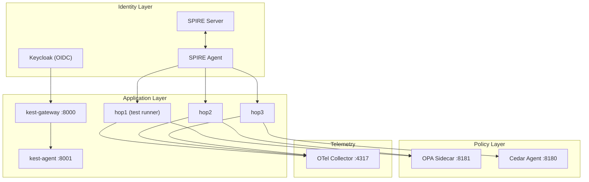

# Kest Lab: Zero Trust Integration Playground

The **kest-lab** is a fully orchestrated Docker Compose environment that validates Kest's cryptographic lineage, trust propagation, and policy enforcement against real infrastructure. It is the definitive proof that the v0.3.0 specification is implementable and correct.

## Why a Lab?

Unit tests with `MockPolicyEngine` and `MockIdentityProvider` validate logic, but they cannot catch:

- **SPIRE attestation failures** — PID namespace mismatches, socket permission errors, SVID rotation race conditions
- **OPA/Cedar policy edge cases** — Rego/Cedar syntax issues, incorrect input schema mapping, sidecar connectivity timeouts
- **Cross-service propagation bugs** — W3C Baggage header encoding, Claim Check cache misses, context loss across async boundaries
- **Keycloak OIDC flows** — Token exchange, scope delegation, JWT claim extraction

The lab tests all of these with real services.

## Architecture


### Service Topology



### Container Details

| Container | Image | Purpose | Key Config |
|---|---|---|---|
| `spire-server` | `ghcr.io/spiffe/spire-server` | Root of trust, issues SVIDs | Trust domain: `kest.internal` |
| `spire-agent` | `ghcr.io/spiffe/spire-agent` | Workload attestation via PID | Unix socket at `/run/spire/sockets/agent.sock` |
| `opa` | `openpolicyagent/opa` | Rego policy evaluation | Port 8181, policies mounted from `opa/policies/` |
| `cedar-agent` | Custom | Cedar policy evaluation | Port 8180, policies from `cedar/policies/` |
| `keycloak` | `quay.io/keycloak/keycloak` | Human identity (OIDC tokens) | Port 8080, realm `kest-lab` |
| `otel-collector` | `otel/opentelemetry-collector` | Span aggregation | gRPC port 4317 |
| `hop1` | Python + Kest | Test runner + first chain node | Runs pytest via `test-live` |
| `hop2`, `hop3` | Python + Kest | Chain continuation nodes | Internal network only |
| `kest-gateway` | Python + FastAPI | Scope-delegated API gateway | Port 8000, uses `KestMiddleware` |
| `kest-agent` | Python + FastAPI | AI agent simulation | Port 8001 |

## Running the Lab

### Prerequisites

- Docker and Docker Compose v2
- `moon` task runner (installed via `proto`)

### Commands

```bash
# Start all services (builds containers if needed)
moon run kest-lab:up

# Run the full integration test suite
moon run kest-core-python:test-live

# View container logs
docker compose -f showcase/kest-lab/docker-compose.yml logs -f hop1

# Tear down
moon run kest-lab:down
```

### Why Tests Run Inside `hop1`

SPIRE attestation requires the test process to run in the same PID namespace as the SPIRE Agent. On Docker Desktop (especially WSL2), the host's PID namespace is isolated from the container's PID namespace. Running tests inside `hop1` ensures:

1. The SPIRE Agent can observe the test process's PID
2. The Unix domain socket is accessible
3. SVIDs are issued to the correct workload identity

The `test-live` moon task handles this automatically by executing `docker compose exec hop1 pytest` instead of running pytest on the host.

## Test Suite: 17 Integration Tests

### 1. Basic Lifecycle Tests

| Test | Validates |
|---|---|
| `test_root_entry_creation` | A root entry has `parent_ids: ["0"]` and correct schema |
| `test_2hop_chain` | Two entries with correct SHA-256 parent hash linkage |
| `test_3hop_chain` | Three-entry Merkle chain, full hash verification |
| `test_taint_propagation` | `added_taints` flow through chain, `removed_taints` sanitize |
| `test_trust_degradation` | Trust score decreases: system(100) → internal(80) → user_input(40) |

### 2. Security Enforcement Tests

| Test | Validates |
|---|---|
| `test_signature_verification` | JWS Ed25519 signatures validate on the complete chain |
| `test_security_halt_on_tamper` | Corrupted JWS detected via HMAC mismatch → execution halts |
| `test_policy_denial_blocks` | `MockPolicyEngine(allow=False)` prevents function execution |
| `test_empty_policy_rejected` | Empty policy list raises configuration error |

### 3. Trust & Taint Tests

| Test | Validates |
|---|---|
| `test_custom_source_type` | `register_origin_trust()` with custom types works in evaluator |
| `test_taint_sanitization` | `removed_taints` correctly clears parent taints |
| `test_trust_override` | `trust_override` bypasses normal propagation |

### 4. Policy Hierarchy Tests

| Test | Validates |
|---|---|
| `test_enterprise_baseline_first` | Enterprise policies evaluate before function policies |
| `test_function_supplements_enterprise` | Function policy doesn't replace enterprise baseline |
| `test_deviation_recorded` | Policy deviations appear in signed `policy_context` |

### 5. Identity Context Tests

| Test | Validates |
|---|---|
| `test_identity_context_recorded` | `user`, `agent`, `task` appear in `labels.kest.identity` |
| `test_resource_attributes_recorded` | `resource_attr` appears in `labels.kest.resource_attr` |

## OPA Policies in the Lab

The lab ships with pre-configured Rego policies at `showcase/kest-lab/opa/policies/`:

### `kest.rego` — Core Trust Policy

```rego
package kest

import rego.v1

default allow := false

allow if {
    input.trust_score >= 10
}
```

This policy implements CARTA: it allows execution only if the cumulative trust score is above a minimum threshold. The threshold is deliberately low (10) to allow most lab test scenarios to pass while still blocking `adversarial` (0) sources.

### `kest/allow_trusted.rego`

```rego
package kest.allow_trusted

import rego.v1

default allow := false

allow if {
    input.trust_score >= 40
}
```

A stricter policy used for functions that handle sensitive operations — requires at least `user_input` level trust.

## Extending the Lab

### Adding a New Test

1. Create a test file in `showcase/kest-lab/tests/`
2. Use the `@pytest.mark.live` marker
3. Add appropriate skip markers for optional services:

```python
import pytest

requires_keycloak = pytest.mark.skipif(
    not keycloak_available(), reason="Keycloak not running"
)

@pytest.mark.live
async def test_my_scenario():
    configure(engine=MockPolicyEngine(allow=True), clear=True)

    @kest_verified(policy="allow", source_type="internal")
    def my_function():
        return {"status": "ok"}

    result = my_function()
    assert result["status"] == "ok"
```

### Adding a New Policy

1. Create a `.rego` file in `showcase/kest-lab/opa/policies/`
2. Reference it in your test via `@kest_verified(policy="your/policy_name")`
3. OPA hot-reloads policies — no container restart needed

### Adding a New Service

1. Add the service to `showcase/kest-lab/docker-compose.yml`
2. Register a SPIRE workload entry for it
3. Add corresponding test cases

## Troubleshooting

| Issue | Cause | Fix |
|---|---|---|
| `ECONNREFUSED 127.0.0.1:8181` | OPA sidecar not ready | Wait for healthcheck: `docker compose up -d --wait` |
| `SPIRE: failed to attest` | PID namespace mismatch | Run tests inside `hop1`, not from host |
| `Claim Check not found` | Cache TTL expired | Increase `SimpleCache(ttl=300)` |
| `signature verification failed` | SVID rotated between sign and verify | Ensure sign + verify happen within SVID lifetime |

---

## Related Concepts
- **[Platform Identity](../concepts/infra/01_identity)**: The theoretical model of workload-to-workload attestation used in the lab.
- **[Integration with SPIRE](../concepts/infra/02_spire)**: Detailed internals of how the lab's SPIRE agent issues SVIDs.
- **[Merkle DAG Lineage](../concepts/design/03_merkle_dag)**: The data structure validated by the `test_3hop_chain` suite.
- **[Audit Trails](../concepts/compliance/02_audit_trails)**: How lab-generated data can be used for zero-trust compliance.

*For the full testing philosophy, see [Testing & Kest Lab](testing). For the spec edge cases this lab validates, see [Spec §11](../concepts/design/kest_spec_v0.3.0).*
