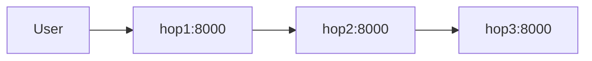

# 3-Hop Distributed Verification

This example demonstrates Kest's ability to maintain and verify cryptographic lineage across three distinct distributed services. This scenario was validated in the Kest Lab using Docker, SPIRE, OPA, and OpenTelemetry.

## Scenario: The Trusted Chain

We have three services: `hop1`, `hop2`, and `hop3`. A request flows from the user through each service. Each service must:
1.  **Verify Identity**: Fetch its X509-SVID from SPIRE.
2.  **Enforce Policy**: Consult OPA to ensure the execution is allowed.
3.  **Sign Lineage**: Create a Merkle-linked signature and export it via OTel.

### The Topology



## Step 1: Execution

The request is triggered at `hop1`. Each subsequent hop extracts the `kest.passport` from the HTTP headers, adds its own signed entry, and passes the updated passport to the next hop.

**Successful Chain Result:**
```json
{
  "service": "hop1",
  "next": {
    "service": "hop2",
    "next": {
      "service": "hop3",
      "status": "end_of_chain"
    }
  }
}
```

## Step 2: Extracting Audit Spans

The OpenTelemetry Collector aggregates the spans from all three services. Each span contains the `kest.signature` attribute.

**Sample Audit Log (Simplified):**
| Service | Entry ID | Parent Hash | signature |
| :--- | :--- | :--- | :--- |
| `hop1` | `uuid-1` | `0` | `eyJhbGci...sig1` |
| `hop2` | `uuid-2` | `hash(sig1)` | `eyJhbGci...sig2` |
| `hop3` | `uuid-3` | `hash(sig2)` | `eyJhbGci...sig3` |

## Step 3: Cryptographic Verification

The `PassportVerifier` takes these signatures and proves the integrity of the chain.

```python
from kest.core import Passport, PassportVerifier

# Signatures extracted from OTel logs
signatures = [sig1, sig2, sig3]
passport = Passport(entries=signatures)

# Verify the Merkle links and JWS signatures
try:
    PassportVerifier.verify(passport, providers={})
    print("SUCCESS: Distributed Merkle Lineage Verified.")
except Exception as e:
    print(f"FAILED: {e}")
```

## Key Takeaways

1.  **Automatic Propagation**: The `KestMiddleware` and `KestHttpxInterceptor` handled the baggage headers without manual code in the business logic.
2.  **Tamper Detection**: If any node in the middle (e.g., `hop2`) had attempted to modify the data or the lineage, the hash link to `hop3` would have failed.
3.  **Audit Fidelity**: The resulting OTel spans provide a mathematically provable record of the entire distributed execution path.
